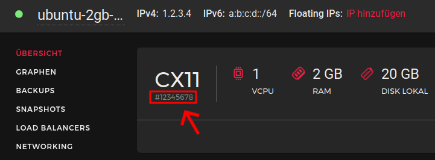

<h1 align="center">💣 hcloud-selfdestruct</h1>
<p align="center">
  <i>A cli tool to self destruct a hetzner cloud server</i>
</p>

<!-- Place https://shields.io/ badges here -->
[](https://github.com/worldworm/hcloud-selfdestruct)
[](https://github.com/worldworm/hcloud-selfdestruct/blob/main/LICENSE)
[](https://github.com/worldworm/hcloud-selfdestruct/commits/main/)
[](https://github.com/worldworm/hcloud-selfdestruct/releases/latest)
[](https://github.com/worldworm/hcloud-selfdestruct/releases/latest)
[](https://pypi.org/project/hcloud-selfdestruct/)
[](https://pypi.org/project/hcloud-selfdestruct/)
[](https://github.com/hetznercloud/awesome-hcloud)
[](https://github.com/codespaces/new?hide_repo_select=true&ref=main&repo=565239435&machine=basicLinux32gb&devcontainer_path=.devcontainer%2Fdevcontainer.json&location=WestEurope)


## Why
Are you using a hetzner cloud server for heavy and long-running computing power? But you don't want to have additional costs when the calculation is done?

With hcloud-selfdestruct, the server instance now self-destructs after the computation and generates no further costs.


> [!WARNING]
> This project is in early development and may not work as expected.


## Installation
```bash
pip install hcloud-selfdestruct
```

## Usage
```
longrunningcommand && hcloud-selfdestruct --api-token abcdefg &
#-- or --
sleep 1h && hcloud-selfdestruct --api-token abcdefg --server-id 12345678 --apprise-id gotify://example.com/token &
```
Note: Only the server is deleted. Attachments such as mounted volumes, floating IPs and more will not be removed.

## Help
```
> hcloud-selfdestruct --help
usage: hcloud-selfdestruct [-h] --api-token API_TOKEN [--server-id SERVER_ID] [--apprise-id APPRISE_ID] [--shutdown] [--version]

cli tool to self destruct a hetzner cloud server

options:
  -h, --help            show this help message and exit

  --api-token API_TOKEN, --api API_TOKEN, --token API_TOKEN
                        hetzner cloud api token

  --server-id SERVER_ID, --server SERVER_ID, --id SERVER_ID
                        server id

  --apprise-id APPRISE_ID, --apprise APPRISE_ID, --notify APPRISE_ID
                        apprise notification string

  --shutdown            just shutdown the server and not destroy it

  --version, -v         show program's version number and exit
```

Find the apprise syntax here: [apprise wiki](https://github.com/caronc/apprise/wiki#notification-services)

Find the server id here (enter without "#")


## Not yet tested
- complete self detection

---
<p align="center">
  <i>© <a href="https://github.com/worldworm">worldworm</a> 2022-2024</i>
  <br><i>Licensed under <a href="https://github.com/worldworm/hcloud-selfdestruct/blob/main/LICENSE">MIT</a></i>
</p>
